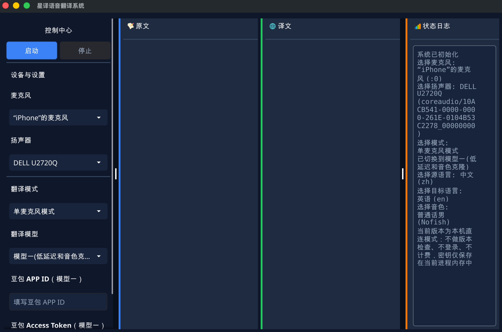

# 🌐 星译语音实时语音翻译系统 - 功能介绍

## 💡 简介

这是一款**实时语音翻译系统**，专为视频会议、在线教育、直播等场景设计。通过虚拟音频设备技术，实现**几秒级**的双向实时翻译，让你在任何应用中都能流畅地进行跨语言交流。

使用需要自行填写豆包同声传译2.0（火山方舟）/千问实时翻译API key，两家均有试用额度。


**核心特点：**
- ⚡ **实时**：几秒级翻译
- 🎯 **即插即用**：无需修改任何应用，通过虚拟音频设备自动工作
- 🔄 **双向翻译**：同时支持说和听的实时翻译
- 🎨 **图形界面**：简洁易用的 GUI，一键启动
- 📱 **跨平台**：支持 macOS 和 Windows

---

## 🚀 核心功能

### 1️⃣ 智能双向翻译模式

在**一个进程**中同时运行两个翻译流：

```
你说中文 ──→ 虚拟麦克风 ──→ 对方听到英文
             ↑
             │ 实时翻译引擎
             ↓
你听中文 ←── 物理扬声器 ←── 对方说英文
```

**适用场景：**
- 🎥 **国际会议**：Zoom、Teams、腾讯会议等
- 🎮 **游戏语音**：Discord、Steam 语音
- 📚 **在线教育**：跨国远程授课
- 💼 **商务谈判**：实时商务沟通

### 2️⃣ 灵活的四种工作模式


| 模式 | 输入 | 输出 | 翻译方向 | 适用场景 |
|------|------|------|---------|---------|
| 🎤 **麦克风模式** | 物理麦克风 | 虚拟麦克风 | 中文→英文 | 你说话对方听翻译 |
| 🔊 **扬声器模式** | 虚拟扬声器 | 物理扬声器 | 英文→中文 | 对方说话你听翻译 |
| 🔄 **双向模式** | 物理麦+虚拟扬声器 | 虚拟麦+物理扬声器 | 双向 | 完整双向对话 |
| 🧪 **回测模式** | 物理麦克风 | 物理扬声器 | 中文→英文 | 测试翻译效果 |

### 3️⃣ 界面




**操作步骤：**
1. 从下拉列表选择麦克风和扬声器设备
2. 选择翻译模式（单向/双向/回测）
3. 配置API
4. 启动


## 📦 系统说明

### macOS

安装包内含有虚拟音频驱动，但是驱动没有提交苹果签名认证，所以无法直接使用（可以关闭SIP后使用）。

安装驱动后，系统音频设备就会多出translator audio音频设备，在需要翻译的软件或者系统中选择此音频设备即可接入翻译系统。

### windows

1. 先解压VB-CABLE.zip,安装VBCABLE_A_Driver_Pack43中的VBCABLE_Setup_x64.exe和VBCABLE_B_Driver_Pack43中的VBCABLE_Setup_x64.exe
2. 安装完两个驱动后重启电脑
3. 打开软件,选择使用的物理设备
4. 在需要翻译的软件中麦克风选择CABLE-A Output, 扬声器选择CABLE-B Input.
  如果软件不支持选择音频设备,可以在系统设置中将默认输入设备修改为CABLE-A Output,默认输出设备修改为CABLE-B Input. 此时其他软件及系统声音都会经过翻译
5. 配置好后,点击启动
---

### 定制/商用

*qairobot@gmail.com*

---

## 免配置API付费版（预计2026年中下线）

**下载和使用文档：**
https://fcnxyalxhimh.feishu.cn/wiki/MOxTwUN3BiYG7DkmMruchpmxnue

---

